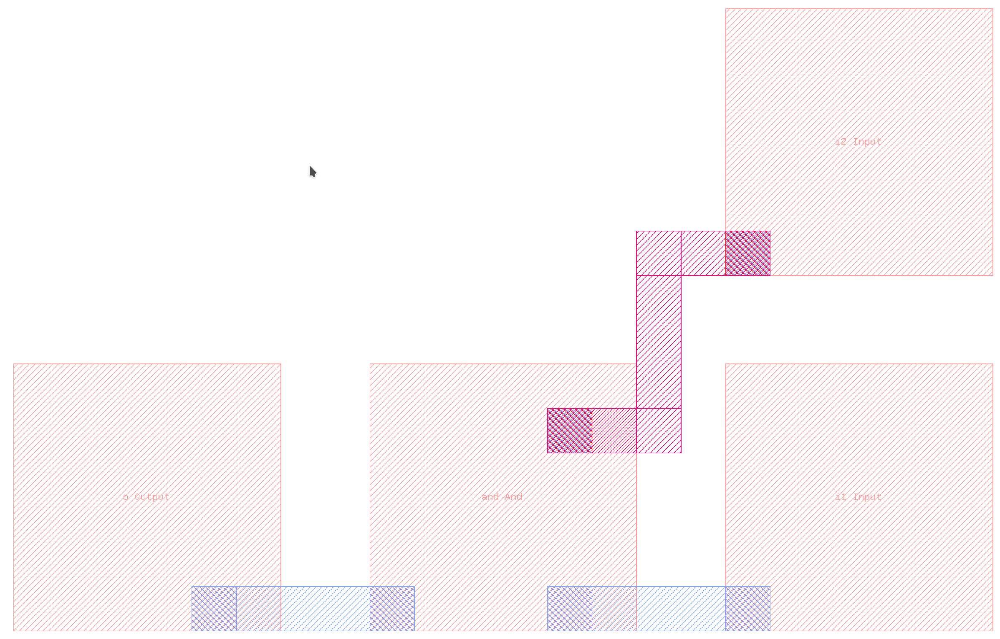
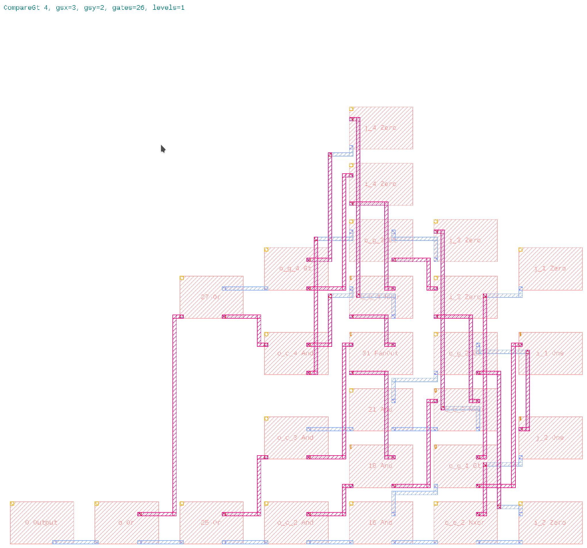
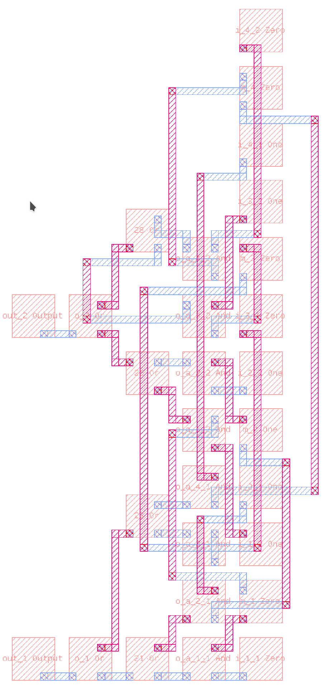
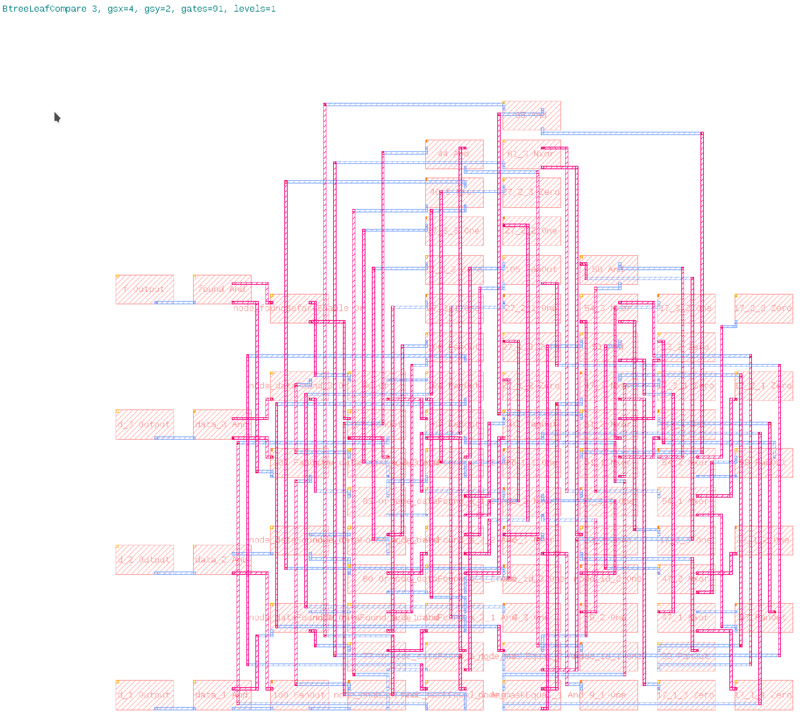
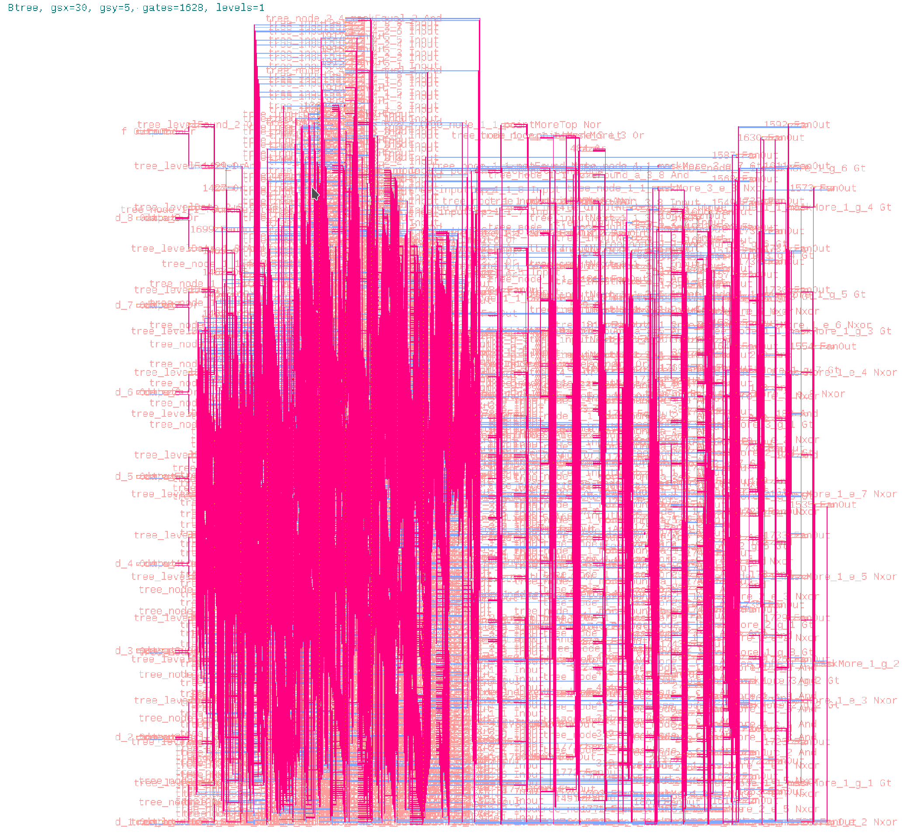

<div>
    <p><a href="https://github.com/philiprbrenan/com.AppaApps.Silicon"></a>
</div>

# Silicon [chip](https://en.wikipedia.org/wiki/Integrated_circuit) 
Design, simulate and layout a [B-Tree](https://en.wikipedia.org/wiki/B-tree) on a [Silicon](https://en.wikipedia.org/wiki/Silicon) [chip](https://en.wikipedia.org/wiki/Integrated_circuit). 
Reasons why you might want to join this project:

http://prb.appaapps.com/zesal/pitchdeck/pitchDeck.html

Or you might want to design your own [RiscV machine](https://github.com/philiprbrenan/com.AppaApps.Silicon/blob/main/RiscV.java) and [operating system](https://en.wikipedia.org/wiki/Operating_system) to run on it.

# Examples

## And

Create a [chip](https://en.wikipedia.org/wiki/Integrated_circuit) that **and**s two input pins together and places the result on
the output [pin](https://en.wikipedia.org/wiki/555_timer_IC). 
```
    Chip c = new Chip("And");
    Gate i = c.Input ("i");
    Gate I = c.Input ("I");
    Gate a = c.And   ("a", i, I);
    Gate o = c.Output("o", a);

    Inputs inputs = c.new Inputs().set(i, true).set(I, false);

    c.simulate(inputs);

    c.draw();

    i.ok(true);
    I.ok(false);
    a.ok(false);
    o.ok(false);
    ok(c.steps, 3);
```

``draw()`` draws a layout [mask](https://en.wikipedia.org/wiki/Integrated_circuit_layout) for the [chip](https://en.wikipedia.org/wiki/Integrated_circuit) using [Graphics Design System 2](https://en.wikipedia.org/wiki/GDSII):



## Compare Greater Than

Compare two unsigned 4 [bit](https://en.wikipedia.org/wiki/Bit) integers to check whether the first is greater than
the second.



## Choose Word Under Mask

Use a [mask](https://en.wikipedia.org/wiki/Integrated_circuit_layout) to choose one [word](https://en.wikipedia.org/wiki/Doc_(computing)) from an [array](https://en.wikipedia.org/wiki/Dynamic_array) of words:



## Btree Node Compare

Locate the [data](https://en.wikipedia.org/wiki/Data) associated with a key in the node of a [B-Tree](https://en.wikipedia.org/wiki/B-tree): 


## Btree

A complete [B-Tree](https://en.wikipedia.org/wiki/B-tree): 


# Gates

A [chip](https://en.wikipedia.org/wiki/Integrated_circuit) is built of standard [Boolean](https://en.wikipedia.org/wiki/Boolean_data_type) logic gates. Each [gate](https://en.wikipedia.org/wiki/Logic_gate) produces a [bit](https://en.wikipedia.org/wiki/Bit) value
that can be used to drive one input [pin](https://en.wikipedia.org/wiki/555_timer_IC) of another [gate](https://en.wikipedia.org/wiki/Logic_gate) or one output [pin](https://en.wikipedia.org/wiki/555_timer_IC). 
Each input [pin](https://en.wikipedia.org/wiki/555_timer_IC) of each [gate](https://en.wikipedia.org/wiki/Logic_gate) can only be driven by one output [pin](https://en.wikipedia.org/wiki/555_timer_IC) of a [gate](https://en.wikipedia.org/wiki/Logic_gate). To
allow one [gate](https://en.wikipedia.org/wiki/Logic_gate) output [pin](https://en.wikipedia.org/wiki/555_timer_IC) to drive several input pins, each [gate](https://en.wikipedia.org/wiki/Logic_gate) produces two
copies of its output [bit](https://en.wikipedia.org/wiki/Bit) enabling the construction of equal depth fan out [trees](https://en.wikipedia.org/wiki/Tree_(data_structure)). 
Some [gate](https://en.wikipedia.org/wiki/Logic_gate) types such as ``or`` and ``and`` can have as many input pins as
requested. The remaining [gate](https://en.wikipedia.org/wiki/Logic_gate) types have no more than two input pins.

# Buses

The single bits transferred by connections between gates can be aggregated into
a [bit bus](https://en.wikipedia.org/wiki/Bus_(computing)) allowing the bits to be manipulated en mass.

A [bit bus](https://en.wikipedia.org/wiki/Bus_(computing)) behaves like a [variable](https://en.wikipedia.org/wiki/Variable_(computer_science)) or like an [array](https://en.wikipedia.org/wiki/Dynamic_array) of [variables](https://en.wikipedia.org/wiki/Variable_(computer_science)) .

## Bit buses

A [bit bus](https://en.wikipedia.org/wiki/Bus_(computing)) corresponds to a [variable](https://en.wikipedia.org/wiki/Variable_(computer_science)) .

```
25 Bit buses
Bits  Bus_____________________________  Value
   3                            data_1  1
   3                            data_2  3
   3                            data_3  5
   3                            enable  7
   3                              find  4
   3                            keys_1  2
   3                            keys_2  4
   3                            keys_3  6
   3                            next_1  1
   3                            next_2  3
   3                            next_3  5
   3                     out_dataFound  3
   3                    out_dataFound1  3
   3                    out_dataFound2  3
   3                            out_id  7
   3                     out_maskEqual  2
   3                      out_maskMore  4
   3                     out_moreFound  5
   3                      out_nextLink  0
   3                     out_nextLink1  0
   3                     out_nextLink2  0
   3                     out_nextLink3  5
   3                     out_nextLink4  5
   3                     out_pointMore  4
   3                               top  7
```

## Words buses

A [word](https://en.wikipedia.org/wiki/Doc_(computing)) [bit bus](https://en.wikipedia.org/wiki/Bus_(computing)) correspond to an [array](https://en.wikipedia.org/wiki/Dynamic_array) of [variables](https://en.wikipedia.org/wiki/Variable_(computer_science)) .

```

3 Word buses
Words Bits  Bus_____________________________
   3     3                              data  1, 3, 5
   3     3                              keys  2, 4, 6
   3     3                              next  1, 3, 5
```

# Diagnostics

## Trace

Execution traces show how the state of the [chip](https://en.wikipedia.org/wiki/Integrated_circuit) evolves over time.

```
    Chip  c = new Chip    ("DelayBits");
    Pulse p = c.pulse     ("p",   8);
    Bits  d = c.delayBits ("b",  16, p);
    Bits  o = c.outputBits("o",      d);

    c.executionTrace("p d", "%s %s", p, d);
    c.simulationSteps(16);
    c.simulate();

    c.ok("""
Step  p d
   1  1 ...............1
   2  0 ..............10
   3  0 .............100
   4  0 ............1000
   5  0 ...........10000
   6  0 ..........100000
   7  0 .........1000000
   8  0 ........10000000
   9  1 .......100000001
  10  0 ......1000000010
  11  0 .....10000000100
  12  0 ....100000001000
  13  0 ...1000000010000
  14  0 ..10000000100000
  15  0 .100000001000000
  16  0 1000000010000000
""");
```

## State

Use the ``say(Chip s)`` method to print the current state of the [chip](https://en.wikipedia.org/wiki/Integrated_circuit): 
```
Chip: BtreeNodeCompare 3 # Gates: 216  Maximum distance: 13  mostCountedDistance: 7  countAtMostCountedDistance: 28

Seq   Name____________________________  Operator  #  11111111111111111111111111111111-P=#  22222222222222222222222222222222-P=#  C Frst Last  Dist   Nearest  Px__,Py__  Drives these gates
 102                               101        Or  1                out_maskMore_3_c_2-2=0                out_maskMore_3_c_3-2=1  0    0    0     8                    out_nextLink_3     0,   0  out_maskMore_3
 114                               113        Or  1              out_dataFound2_a_1_1-2=0              out_dataFound2_a_2_1-2=1  0    0    0     3                   out_dataFound_1     0,   0  out_dataFound2_1
 117                               116        Or  1              out_dataFound2_a_1_2-2=0              out_dataFound2_a_2_2-2=1  0    0    0     3                   out_dataFound_2     0,   0  out_dataFound2_2
 120                               119        Or  0              out_dataFound2_a_1_3-2=0              out_dataFound2_a_2_3-2=0  0    0    0     3                   out_dataFound_3     0,   0  out_dataFound2_3
 123                               122        Or  1                               223-2=0                               225-2=1  0    0    0     3                         out_found     0,   0  out_found2
 126                               125       Nor  1                               229-2=0                               230-2=0  0    0    0     9                    out_nextLink_3     0,   0  out_noMore
 141                               140        Or  0               out_moreFound_a_1_1-2=0               out_moreFound_a_2_1-2=0  0    0    0     8                    out_nextLink_1     0,   0  out_moreFound_1
 144                               143        Or  0               out_moreFound_a_1_2-2=0               out_moreFound_a_2_2-2=0  0    0    0     8                    out_nextLink_2     0,   0  out_moreFound_2
 147                               146        Or  0               out_moreFound_a_1_3-2=0               out_moreFound_a_2_3-2=0  0    0    0     8                    out_nextLink_3     0,   0  out_moreFound_3
 150                               149       Not  1                               231-2=0                                  -.=.  0    0    0     7                    out_nextLink_2     0,   0  192, out_nextLink4_a_3
 161                               160       Nor  1                               236-2=0                               238-2=0  0    0    0     5                    out_nextLink_3     0,   0  out_pointMoreTop
 179                               178       Not  1                               234-2=0                                  -.=.  0    0    0     3                    out_nextLink_2     0,   0  193, out_nextLink1_a_3
 192                               192    FanOut  1                               149-2=1                                  -.=.  0    0    0     7                    out_nextLink_2     0,   0  out_nextLink4_a_1, out_nextLink4_a_2
 193                               193    FanOut  1                               178-2=1                                  -.=.  0    0    0     3                    out_nextLink_2     0,   0  out_nextLink1_a_1, out_nextLink1_a_2
 194                               194    FanOut  0                            find_1-2=0                                  -.=.  0    0    0     7                   out_dataFound_3     0,   0  196, 85_1
 195                               195    FanOut  0                            find_1-2=0                                  -.=.  0    0    0    12                    out_nextLink_3     0,   0  197, out_maskMore_3_g_1>2
 196                               196    FanOut  0                               194-2=0                                  -.=.  0    0    0     8                   out_dataFound_3     0,   0  47_1, 66_1
 197                               197    FanOut  0                               195-2=0                                  -.=.  0    0    0    12                    out_nextLink_3     0,   0  out_maskMore_1_g_1>2, out_maskMore_2_g_1>2
 198                               198    FanOut  0                            find_2-2=0                                  -.=.  0    0    0     9                    out_nextLink_3     0,   0  199, 200
 199                               199    FanOut  0                               198-2=0                                  -.=.  0    0    0     8                   out_dataFound_3     0,   0  201, 202
 200                               200    FanOut  0                               198-2=0                                  -.=.  0    0    0    12                    out_nextLink_3     0,   0  203, 204
 201                               201    FanOut  0                               199-2=0                                  -.=.  0    0    0     8                   out_dataFound_3     0,   0  47_2, 66_2
 202                               202    FanOut  0                               199-2=0                                  -.=.  0    0    0     7                    out_nextLink_3     0,   0  85_2, out_maskMore_1_e_2
 203                               203    FanOut  0                               200-2=0                                  -.=.  0    0    0    12                    out_nextLink_3     0,   0  out_maskMore_1_g_2>2, out_maskMore_2_e_2
 204                               204    FanOut  0                               200-2=0                                  -.=.  0    0    0    11                    out_nextLink_3     0,   0  out_maskMore_2_g_2>2, out_maskMore_3_e_2
 205                               205    FanOut  1                            find_3-2=1                                  -.=.  0    0    0     8                    out_nextLink_3     0,   0  206, 207
 206                               206    FanOut  1                               205-2=1                                  -.=.  0    0    0     7                   out_dataFound_3     0,   0  208, 209
 207                               207    FanOut  1                               205-2=1                                  -.=.  0    0    0    10                    out_nextLink_3     0,   0  210, 211
 208                               208    FanOut  1                               206-2=1                                  -.=.  0    0    0     7                   out_dataFound_3     0,   0  47_3, 66_3
 209                               209    FanOut  1                               206-2=1                                  -.=.  0    0    0     6                    out_nextLink_3     0,   0  85_3, out_maskMore_1_e_3
 210                               210    FanOut  1                               207-2=1                                  -.=.  0    0    0    10                    out_nextLink_3     0,   0  out_maskMore_1_g_3>2, out_maskMore_2_e_3
 211                               211    FanOut  1                               207-2=1                                  -.=.  0    0    0     9                    out_nextLink_3     0,   0  out_maskMore_2_g_3>2, out_maskMore_3_e_3
 212                               212    FanOut  1                          keys_1_2-2=1                                  -.=.  0    0    0     8                    out_nextLink_3     0,   0  47_2, out_maskMore_1_e_2
 213                               213    FanOut  0                          keys_1_3-2=0                                  -.=.  0    0    0     7                    out_nextLink_3     0,   0  47_3, out_maskMore_1_e_3
 214                               214    FanOut  0                          keys_2_2-2=0                                  -.=.  0    0    0     8                    out_nextLink_3     0,   0  66_2, out_maskMore_2_e_2
 215                               215    FanOut  1                          keys_2_3-2=1                                  -.=.  0    0    0     7                    out_nextLink_3     0,   0  66_3, out_maskMore_2_e_3
 216                               216    FanOut  1                          keys_3_2-2=1                                  -.=.  0    0    0     7                    out_nextLink_3     0,   0  85_2, out_maskMore_3_e_2
 217                               217    FanOut  1                          keys_3_3-2=1                                  -.=.  0    0    0     6                    out_nextLink_3     0,   0  85_3, out_maskMore_3_e_3
 218                               218    FanOut  1                       out_enabled-2=1                                  -.=.  0    0    0     3                         out_found     0,   0  219, 220
 219                               219    FanOut  1                               218-2=1                                  -.=.  0    0    0     2                   out_dataFound_2     0,   0  221, out_dataFound1_3
 220                               220    FanOut  1                               218-2=1                                  -.=.  0    0    0     3                    out_nextLink_2     0,   0  222, out_nextLink3_2
 221                               221    FanOut  1                               219-2=1                                  -.=.  0    0    0     2                   out_dataFound_2     0,   0  out_dataFound1_1, out_dataFound1_2
 222                               222    FanOut  1                               220-2=1                                  -.=.  0    0    0     2                    out_nextLink_1     0,   0  out_found1, out_nextLink3_1
 223                               223    FanOut  0                   out_maskEqual_1-2=0                                  -.=.  0    0    0     4                   out_dataFound_1     0,   0  122, out_dataFound2_a_1_1
 224                               224    FanOut  0                   out_maskEqual_1-2=0                                  -.=.  0    0    0     5                   out_dataFound_3     0,   0  out_dataFound2_a_1_2, out_dataFound2_a_1_3
 225                               225    FanOut  1                   out_maskEqual_2-2=1                                  -.=.  0    0    0     4                   out_dataFound_1     0,   0  122, out_dataFound2_a_2_1
 226                               226    FanOut  1                   out_maskEqual_2-2=1                                  -.=.  0    0    0     5                   out_dataFound_3     0,   0  out_dataFound2_a_2_2, out_dataFound2_a_2_3
 227                               227    FanOut  0                   out_maskEqual_3-2=0                                  -.=.  0    0    0     4                   out_dataFound_2     0,   0  out_dataFound2_a_3_1, out_dataFound2_a_3_2
 228                               228    FanOut  0                   out_maskEqual_3-2=0                                  -.=.  0    0    0     3                   out_dataFound_3     0,   0  out_dataFound2_a_3_3, out_found2
 229                               229    FanOut  0                    out_maskMore_1-2=0                                  -.=.  0    0    0     8                    out_nextLink_3     0,   0  125, out_pointMore_1
 230                               230    FanOut  0                    out_maskMore_2-2=0                                  -.=.  0    0    0     8                    out_nextLink_3     0,   0  125, out_pointMore_2>2
 231                               231    FanOut  0                        out_noMore-2=0                                  -.=.  0    0    0     7                    out_nextLink_3     0,   0  149, out_nextLink4_b_1
 232                               232    FanOut  0                        out_noMore-2=0                                  -.=.  0    0    0     7                    out_nextLink_3     0,   0  out_nextLink4_b_2, out_nextLink4_b_3
 233                               233    FanOut  0                      out_notFound-2=0                                  -.=.  0    0    0     4                    out_nextLink_2     0,   0  out_nextLink2_1, out_nextLink2_2
 234                               234    FanOut  0                  out_pointMoreTop-2=0                                  -.=.  0    0    0     3                    out_nextLink_3     0,   0  178, out_nextLink1_b_1
 235                               235    FanOut  0                  out_pointMoreTop-2=0                                  -.=.  0    0    0     3                    out_nextLink_3     0,   0  out_nextLink1_b_2, out_nextLink1_b_3
 236                               236    FanOut  0                   out_pointMore_1-2=0                                  -.=.  0    0    0     6                    out_nextLink_1     0,   0  160, out_moreFound_a_1_1
 237                               237    FanOut  0                   out_pointMore_1-2=0                                  -.=.  0    0    0    10                    out_nextLink_3     0,   0  out_moreFound_a_1_2, out_moreFound_a_1_3
 238                               238    FanOut  0                   out_pointMore_2-2=0                                  -.=.  0    0    0     6                    out_nextLink_1     0,   0  160, out_moreFound_a_2_1
 239                               239    FanOut  0                   out_pointMore_2-2=0                                  -.=.  0    0    0    10                    out_nextLink_3     0,   0  out_moreFound_a_2_2, out_moreFound_a_2_3
 240                               240    FanOut  1                   out_pointMore_3-2=1                                  -.=.  0    0    0     9                    out_nextLink_2     0,   0  out_moreFound_a_3_1, out_moreFound_a_3_2
 241                               241    FanOut  1                   out_pointMore_3-2=1                                  -.=.  0    0    0     5                    out_nextLink_3     0,   0  out_moreFound_a_3_3, out_pointMoreTop
  41                              40_1      Nxor  1                          enable_1-2=1                          out_id_1-2=1  0    0    0     6                   out_dataFound_3     0,   0  44
  42                              40_2      Nxor  1                          enable_2-2=1                          out_id_2-2=1  0    0    0     6                   out_dataFound_3     0,   0  44
  43                              40_3      Nxor  1                          enable_3-2=1                          out_id_3-2=1  0    0    0     5                   out_dataFound_3     0,   0  out_enabled
  45                                44       And  1                              40_1-2=1                              40_2-2=1  0    0    0     5                   out_dataFound_3     0,   0  out_enabled
  48                              47_1      Nxor  1                               196-2=0                          keys_1_1-2=0  0    0    0     7                   out_dataFound_3     0,   0  51
  49                              47_2      Nxor  0                               201-2=0                               212-2=1  0    0    0     7                   out_dataFound_3     0,   0  51
  50                              47_3      Nxor  0                               208-2=1                               213-2=0  0    0    0     6                   out_dataFound_3     0,   0  out_maskEqual_1
  52                                51       And  0                              47_1-2=1                              47_2-2=0  0    0    0     6                   out_dataFound_3     0,   0  out_maskEqual_1
  60                                59       And  0                out_maskMore_1_e_2-2=0                out_maskMore_1_g_1-2=0  0    0    0    11                    out_nextLink_3     0,   0  out_maskMore_1_c_2
  64                                63        Or  0                out_maskMore_1_c_2-2=0                out_maskMore_1_c_3-2=0  0    0    0     9                    out_nextLink_3     0,   0  out_maskMore_1
  67                              66_1      Nxor  1                               196-2=0                          keys_2_1-2=0  0    0    0     7                   out_dataFound_3     0,   0  70
  68                              66_2      Nxor  1                               201-2=0                               214-2=0  0    0    0     7                   out_dataFound_3     0,   0  70
  69                              66_3      Nxor  1                               208-2=1                               215-2=1  0    0    0     6                   out_dataFound_3     0,   0  out_maskEqual_2
  71                                70       And  1                              66_1-2=1                              66_2-2=1  0    0    0     6                   out_dataFound_3     0,   0  out_maskEqual_2
  79                                78       And  0                out_maskMore_2_e_2-2=1                out_maskMore_2_g_1-2=0  0    0    0    10                    out_nextLink_3     0,   0  out_maskMore_2_c_2
  83                                82        Or  0                out_maskMore_2_c_2-2=0                out_maskMore_2_c_3-2=0  0    0    0     8                    out_nextLink_3     0,   0  out_maskMore_2
  86                              85_1      Nxor  1                               194-2=0                          keys_3_1-2=0  0    0    0     6                   out_dataFound_2     0,   0  89
  87                              85_2      Nxor  0                               202-2=0                               216-2=1  0    0    0     6                   out_dataFound_2     0,   0  89
  88                              85_3      Nxor  1                               209-2=1                               217-2=1  0    0    0     5                   out_dataFound_2     0,   0  out_maskEqual_3
  90                                89       And  0                              85_1-2=1                              85_2-2=0  0    0    0     5                   out_dataFound_2     0,   0  out_maskEqual_3
  98                                97       And  0                out_maskMore_3_e_2-2=0                out_maskMore_3_g_1-2=0  0    0    0    10                    out_nextLink_3     0,   0  out_maskMore_3_c_2
  19                          data_1_1       One  1                                  -.=.                                  -.=.  0    0    0     5                   out_dataFound_1     0,   0  out_dataFound2_a_1_1
  20                          data_1_2      Zero  0                                  -.=.                                  -.=.  0    0    0     5                   out_dataFound_2     0,   0  out_dataFound2_a_1_2
  21                          data_1_3      Zero  0                                  -.=.                                  -.=.  0    0    0     5                   out_dataFound_3     0,   0  out_dataFound2_a_1_3
  22                          data_2_1       One  1                                  -.=.                                  -.=.  0    0    0     5                   out_dataFound_1     0,   0  out_dataFound2_a_2_1
  23                          data_2_2       One  1                                  -.=.                                  -.=.  0    0    0     5                   out_dataFound_2     0,   0  out_dataFound2_a_2_2
  24                          data_2_3      Zero  0                                  -.=.                                  -.=.  0    0    0     5                   out_dataFound_3     0,   0  out_dataFound2_a_2_3
  25                          data_3_1       One  1                                  -.=.                                  -.=.  0    0    0     4                   out_dataFound_1     0,   0  out_dataFound2_a_3_1
  26                          data_3_2      Zero  0                                  -.=.                                  -.=.  0    0    0     4                   out_dataFound_2     0,   0  out_dataFound2_a_3_2
  27                          data_3_3       One  1                                  -.=.                                  -.=.  0    0    0     4                   out_dataFound_3     0,   0  out_dataFound2_a_3_3
   1                          enable_1       One  1                                  -.=.                                  -.=.  0    0    0     7                   out_dataFound_3     0,   0  40_1
   2                          enable_2       One  1                                  -.=.                                  -.=.  0    0    0     7                   out_dataFound_3     0,   0  40_2
   3                          enable_3       One  1                                  -.=.                                  -.=.  0    0    0     6                   out_dataFound_3     0,   0  40_3
   4                            find_1      Zero  0                                  -.=.                                  -.=.  0    0    0     8                    out_nextLink_3     0,   0  194, 195
   5                            find_2      Zero  0                                  -.=.                                  -.=.  0    0    0    10                    out_nextLink_3     0,   0  198, out_maskMore_3_g_2>2
   6                            find_3       One  1                                  -.=.                                  -.=.  0    0    0     9                    out_nextLink_3     0,   0  205, out_maskMore_3_g_3>2
  10                          keys_1_1      Zero  0                                  -.=.                                  -.=.  0    0    0     8                    out_nextLink_3     0,   0  47_1, out_maskMore_1_g_1>1
  11                          keys_1_2       One  1                                  -.=.                                  -.=.  0    0    0     9                    out_nextLink_3     0,   0  212, out_maskMore_1_g_2>1
  12                          keys_1_3      Zero  0                                  -.=.                                  -.=.  0    0    0     8                    out_nextLink_3     0,   0  213, out_maskMore_1_g_3>1
  13                          keys_2_1      Zero  0                                  -.=.                                  -.=.  0    0    0     8                    out_nextLink_3     0,   0  66_1, out_maskMore_2_g_1>1
  14                          keys_2_2      Zero  0                                  -.=.                                  -.=.  0    0    0     9                    out_nextLink_3     0,   0  214, out_maskMore_2_g_2>1
  15                          keys_2_3       One  1                                  -.=.                                  -.=.  0    0    0     8                    out_nextLink_3     0,   0  215, out_maskMore_2_g_3>1
  16                          keys_3_1      Zero  0                                  -.=.                                  -.=.  0    0    0     7                    out_nextLink_3     0,   0  85_1, out_maskMore_3_g_1>1
  17                          keys_3_2       One  1                                  -.=.                                  -.=.  0    0    0     8                    out_nextLink_3     0,   0  216, out_maskMore_3_g_2>1
  18                          keys_3_3       One  1                                  -.=.                                  -.=.  0    0    0     7                    out_nextLink_3     0,   0  217, out_maskMore_3_g_3>1
  28                          next_1_1       One  1                                  -.=.                                  -.=.  0    0    0    10                    out_nextLink_1     0,   0  out_moreFound_a_1_1
  29                          next_1_2      Zero  0                                  -.=.                                  -.=.  0    0    0    10                    out_nextLink_2     0,   0  out_moreFound_a_1_2
  30                          next_1_3      Zero  0                                  -.=.                                  -.=.  0    0    0    10                    out_nextLink_3     0,   0  out_moreFound_a_1_3
  31                          next_2_1       One  1                                  -.=.                                  -.=.  0    0    0    10                    out_nextLink_1     0,   0  out_moreFound_a_2_1
  32                          next_2_2       One  1                                  -.=.                                  -.=.  0    0    0    10                    out_nextLink_2     0,   0  out_moreFound_a_2_2
  33                          next_2_3      Zero  0                                  -.=.                                  -.=.  0    0    0    10                    out_nextLink_3     0,   0  out_moreFound_a_2_3
  34                          next_3_1       One  1                                  -.=.                                  -.=.  0    0    0     9                    out_nextLink_1     0,   0  out_moreFound_a_3_1
  35                          next_3_2      Zero  0                                  -.=.                                  -.=.  0    0    0     9                    out_nextLink_2     0,   0  out_moreFound_a_3_2
  36                          next_3_3       One  1                                  -.=.                                  -.=.  0    0    0     9                    out_nextLink_3     0,   0  out_moreFound_a_3_3
 163                  out_dataFound1_1       And  1                               221-2=1                  out_dataFound2_1-2=1  0    0    0     1                   out_dataFound_1     0,   0  out_dataFound_1
 164                  out_dataFound1_2       And  1                               221-2=1                  out_dataFound2_2-2=1  0    0    0     1                   out_dataFound_2     0,   0  out_dataFound_2
 165                  out_dataFound1_3       And  0                               219-2=1                  out_dataFound2_3-2=0  0    0    0     1                   out_dataFound_3     0,   0  out_dataFound_3
 115                  out_dataFound2_1        Or  1                               113-2=1              out_dataFound2_a_3_1-2=0  0    0    0     2                   out_dataFound_1     0,   0  out_dataFound1_1
 118                  out_dataFound2_2        Or  1                               116-2=1              out_dataFound2_a_3_2-2=0  0    0    0     2                   out_dataFound_2     0,   0  out_dataFound1_2
 121                  out_dataFound2_3        Or  0                               119-2=0              out_dataFound2_a_3_3-2=0  0    0    0     2                   out_dataFound_3     0,   0  out_dataFound1_3
 104              out_dataFound2_a_1_1       And  0                               223-2=0                          data_1_1-2=1  0    0    0     4                   out_dataFound_1     0,   0  113
 105              out_dataFound2_a_1_2       And  0                               224-2=0                          data_1_2-2=0  0    0    0     4                   out_dataFound_2     0,   0  116
 106              out_dataFound2_a_1_3       And  0                               224-2=0                          data_1_3-2=0  0    0    0     4                   out_dataFound_3     0,   0  119
 107              out_dataFound2_a_2_1       And  1                               225-2=1                          data_2_1-2=1  0    0    0     4                   out_dataFound_1     0,   0  113
 108              out_dataFound2_a_2_2       And  1                               226-2=1                          data_2_2-2=1  0    0    0     4                   out_dataFound_2     0,   0  116
 109              out_dataFound2_a_2_3       And  0                               226-2=1                          data_2_3-2=0  0    0    0     4                   out_dataFound_3     0,   0  119
 110              out_dataFound2_a_3_1       And  0                               227-2=0                          data_3_1-2=1  0    0    0     3                   out_dataFound_1     0,   0  out_dataFound2_1
 111              out_dataFound2_a_3_2       And  0                               227-2=0                          data_3_2-2=0  0    0    0     3                   out_dataFound_2     0,   0  out_dataFound2_2
 112              out_dataFound2_a_3_3       And  0                               228-2=0                          data_3_3-2=1  0    0    0     3                   out_dataFound_3     0,   0  out_dataFound2_3
 166                   out_dataFound_1    Output  1                  out_dataFound1_1-2=1                                  -.=.  0    0    0     0                   out_dataFound_1     0,   0
 167                   out_dataFound_2    Output  1                  out_dataFound1_2-2=1                                  -.=.  0    0    0     0                   out_dataFound_2     0,   0
 168                   out_dataFound_3    Output  0                  out_dataFound1_3-2=0                                  -.=.  0    0    0     0                   out_dataFound_3     0,   0
  46                       out_enabled       And  1                              40_3-2=1                                44-2=1  0    0    0     4                    out_nextLink_3     0,   0  218, out_nextLink3_3
 170                         out_found    Output  1                        out_found1-2=1                                  -.=.  0    0    0     0                         out_found     0,   0
 169                        out_found1       And  1                               222-2=1                        out_found2-2=1  0    0    0     1                    out_nextLink_2     0,   0  out_found, out_notFound
 124                        out_found2        Or  1                               122-2=1                               228-2=0  0    0    0     2                         out_found     0,   0  out_found1
  37                          out_id_1       One  1                                  -.=.                                  -.=.  0    0    0     7                   out_dataFound_3     0,   0  40_1
  38                          out_id_2       One  1                                  -.=.                                  -.=.  0    0    0     7                   out_dataFound_3     0,   0  40_2
  39                          out_id_3       One  1                                  -.=.                                  -.=.  0    0    0     6                   out_dataFound_3     0,   0  40_3
  53                   out_maskEqual_1       And  0                              47_3-2=0                                51-2=0  0    0    0     5                   out_dataFound_3     0,   0  223, 224
  72                   out_maskEqual_2       And  1                              66_3-2=1                                70-2=1  0    0    0     5                   out_dataFound_3     0,   0  225, 226
  91                   out_maskEqual_3       And  0                              85_3-2=1                                89-2=0  0    0    0     4                   out_dataFound_2     0,   0  227, 228
  65                    out_maskMore_1        Or  0                                63-2=0                out_maskMore_1_g_3-2=0  0    0    0     8                    out_nextLink_3     0,   0  229, out_pointMore_2>1
  61                out_maskMore_1_c_2       And  0                                59-2=0                out_maskMore_1_e_3-2=0  0    0    0    10                    out_nextLink_3     0,   0  63
  62                out_maskMore_1_c_3       And  0                out_maskMore_1_e_3-2=0                out_maskMore_1_g_2-2=1  0    0    0    10                    out_nextLink_3     0,   0  63
  54                out_maskMore_1_e_2      Nxor  0                               202-2=0                               212-2=1  0    0    0    12                    out_nextLink_3     0,   0  59
  55                out_maskMore_1_e_3      Nxor  0                               209-2=1                               213-2=0  0    0    0    11                    out_nextLink_3     0,   0  out_maskMore_1_c_2, out_maskMore_1_c_3
  56                out_maskMore_1_g_1        Gt  0                          keys_1_1-2=0                               197-2=0  0    0    0    12                    out_nextLink_3     0,   0  59
  57                out_maskMore_1_g_2        Gt  1                          keys_1_2-2=1                               203-2=0  0    0    0    11                    out_nextLink_3     0,   0  out_maskMore_1_c_3
  58                out_maskMore_1_g_3        Gt  0                          keys_1_3-2=0                               210-2=1  0    0    0     9                    out_nextLink_3     0,   0  out_maskMore_1
  84                    out_maskMore_2        Or  0                                82-2=0                out_maskMore_2_g_3-2=0  0    0    0     7                    out_nextLink_3     0,   0  230, out_pointMore_3>1
  80                out_maskMore_2_c_2       And  0                                78-2=0                out_maskMore_2_e_3-2=1  0    0    0     9                    out_nextLink_3     0,   0  82
  81                out_maskMore_2_c_3       And  0                out_maskMore_2_e_3-2=1                out_maskMore_2_g_2-2=0  0    0    0     9                    out_nextLink_3     0,   0  82
  73                out_maskMore_2_e_2      Nxor  1                               203-2=0                               214-2=0  0    0    0    11                    out_nextLink_3     0,   0  78
  74                out_maskMore_2_e_3      Nxor  1                               210-2=1                               215-2=1  0    0    0    10                    out_nextLink_3     0,   0  out_maskMore_2_c_2, out_maskMore_2_c_3
  75                out_maskMore_2_g_1        Gt  0                          keys_2_1-2=0                               197-2=0  0    0    0    11                    out_nextLink_3     0,   0  78
  76                out_maskMore_2_g_2        Gt  0                          keys_2_2-2=0                               204-2=0  0    0    0    10                    out_nextLink_3     0,   0  out_maskMore_2_c_3
  77                out_maskMore_2_g_3        Gt  0                          keys_2_3-2=1                               211-2=1  0    0    0     8                    out_nextLink_3     0,   0  out_maskMore_2
 103                    out_maskMore_3        Or  1                               101-2=1                out_maskMore_3_g_3-2=0  0    0    0     7                    out_nextLink_3     0,   0  out_noMore, out_pointMore_3>2
  99                out_maskMore_3_c_2       And  0                                97-2=0                out_maskMore_3_e_3-2=1  0    0    0     9                    out_nextLink_3     0,   0  101
 100                out_maskMore_3_c_3       And  1                out_maskMore_3_e_3-2=1                out_maskMore_3_g_2-2=1  0    0    0     9                    out_nextLink_3     0,   0  101
  92                out_maskMore_3_e_2      Nxor  0                               204-2=0                               216-2=1  0    0    0    11                    out_nextLink_3     0,   0  97
  93                out_maskMore_3_e_3      Nxor  1                               211-2=1                               217-2=1  0    0    0    10                    out_nextLink_3     0,   0  out_maskMore_3_c_2, out_maskMore_3_c_3
  94                out_maskMore_3_g_1        Gt  0                          keys_3_1-2=0                               195-2=0  0    0    0    11                    out_nextLink_3     0,   0  97
  95                out_maskMore_3_g_2        Gt  1                          keys_3_2-2=1                            find_2-2=0  0    0    0    10                    out_nextLink_3     0,   0  out_maskMore_3_c_3
  96                out_maskMore_3_g_3        Gt  0                          keys_3_3-2=1                            find_3-2=1  0    0    0     8                    out_nextLink_3     0,   0  out_maskMore_3
 142                   out_moreFound_1        Or  1                               140-2=0               out_moreFound_a_3_1-2=1  0    0    0     7                    out_nextLink_1     0,   0  out_nextLink4_a_1
 145                   out_moreFound_2        Or  0                               143-2=0               out_moreFound_a_3_2-2=0  0    0    0     7                    out_nextLink_2     0,   0  out_nextLink4_a_2
 148                   out_moreFound_3        Or  1                               146-2=0               out_moreFound_a_3_3-2=1  0    0    0     7                    out_nextLink_3     0,   0  out_nextLink4_a_3
 131               out_moreFound_a_1_1       And  0                               236-2=0                          next_1_1-2=1  0    0    0     9                    out_nextLink_1     0,   0  140
 132               out_moreFound_a_1_2       And  0                               237-2=0                          next_1_2-2=0  0    0    0     9                    out_nextLink_2     0,   0  143
 133               out_moreFound_a_1_3       And  0                               237-2=0                          next_1_3-2=0  0    0    0     9                    out_nextLink_3     0,   0  146
 134               out_moreFound_a_2_1       And  0                               238-2=0                          next_2_1-2=1  0    0    0     9                    out_nextLink_1     0,   0  140
 135               out_moreFound_a_2_2       And  0                               239-2=0                          next_2_2-2=1  0    0    0     9                    out_nextLink_2     0,   0  143
 136               out_moreFound_a_2_3       And  0                               239-2=0                          next_2_3-2=0  0    0    0     9                    out_nextLink_3     0,   0  146
 137               out_moreFound_a_3_1       And  1                               240-2=1                          next_3_1-2=1  0    0    0     8                    out_nextLink_1     0,   0  out_moreFound_1
 138               out_moreFound_a_3_2       And  0                               240-2=1                          next_3_2-2=0  0    0    0     8                    out_nextLink_2     0,   0  out_moreFound_2
 139               out_moreFound_a_3_3       And  1                               241-2=1                          next_3_3-2=1  0    0    0     8                    out_nextLink_3     0,   0  out_moreFound_3
 182                   out_nextLink1_1        Or  0                 out_nextLink1_a_1-2=0                 out_nextLink1_b_1-2=0  0    0    0     1                    out_nextLink_1     0,   0  out_nextLink_1
 185                   out_nextLink1_2        Or  0                 out_nextLink1_a_2-2=0                 out_nextLink1_b_2-2=0  0    0    0     1                    out_nextLink_2     0,   0  out_nextLink_2
 188                   out_nextLink1_3        Or  0                 out_nextLink1_a_3-2=0                 out_nextLink1_b_3-2=0  0    0    0     1                    out_nextLink_3     0,   0  out_nextLink_3
 180                 out_nextLink1_a_1       And  0                               193-2=1                   out_nextLink2_1-2=0  0    0    0     2                    out_nextLink_1     0,   0  out_nextLink1_1
 183                 out_nextLink1_a_2       And  0                               193-2=1                   out_nextLink2_2-2=0  0    0    0     2                    out_nextLink_2     0,   0  out_nextLink1_2
 186                 out_nextLink1_a_3       And  0                               178-2=1                   out_nextLink2_3-2=0  0    0    0     2                    out_nextLink_3     0,   0  out_nextLink1_3
 181                 out_nextLink1_b_1       And  0                               234-2=0                             top_1-2=1  0    0    0     2                    out_nextLink_1     0,   0  out_nextLink1_1
 184                 out_nextLink1_b_2       And  0                               235-2=0                             top_2-2=1  0    0    0     2                    out_nextLink_2     0,   0  out_nextLink1_2
 187                 out_nextLink1_b_3       And  0                               235-2=0                             top_3-2=1  0    0    0     2                    out_nextLink_3     0,   0  out_nextLink1_3
 175                   out_nextLink2_1       And  0                               233-2=0                   out_nextLink3_1-2=1  0    0    0     3                    out_nextLink_1     0,   0  out_nextLink1_a_1
 176                   out_nextLink2_2       And  0                               233-2=0                   out_nextLink3_2-2=0  0    0    0     3                    out_nextLink_2     0,   0  out_nextLink1_a_2
 177                   out_nextLink2_3       And  0                   out_nextLink3_3-2=1                      out_notFound-2=0  0    0    0     3                    out_nextLink_3     0,   0  out_nextLink1_a_3
 171                   out_nextLink3_1       And  1                               222-2=1                   out_nextLink4_1-2=1  0    0    0     4                    out_nextLink_1     0,   0  out_nextLink2_1
 172                   out_nextLink3_2       And  0                               220-2=1                   out_nextLink4_2-2=0  0    0    0     4                    out_nextLink_2     0,   0  out_nextLink2_2
 173                   out_nextLink3_3       And  1                       out_enabled-2=1                   out_nextLink4_3-2=1  0    0    0     4                    out_nextLink_3     0,   0  out_nextLink2_3
 153                   out_nextLink4_1        Or  1                 out_nextLink4_a_1-2=1                 out_nextLink4_b_1-2=0  0    0    0     5                    out_nextLink_1     0,   0  out_nextLink3_1
 156                   out_nextLink4_2        Or  0                 out_nextLink4_a_2-2=0                 out_nextLink4_b_2-2=0  0    0    0     5                    out_nextLink_2     0,   0  out_nextLink3_2
 159                   out_nextLink4_3        Or  1                 out_nextLink4_a_3-2=1                 out_nextLink4_b_3-2=0  0    0    0     5                    out_nextLink_3     0,   0  out_nextLink3_3
 151                 out_nextLink4_a_1       And  1                               192-2=1                   out_moreFound_1-2=1  0    0    0     6                    out_nextLink_1     0,   0  out_nextLink4_1
 154                 out_nextLink4_a_2       And  0                               192-2=1                   out_moreFound_2-2=0  0    0    0     6                    out_nextLink_2     0,   0  out_nextLink4_2
 157                 out_nextLink4_a_3       And  1                               149-2=1                   out_moreFound_3-2=1  0    0    0     6                    out_nextLink_3     0,   0  out_nextLink4_3
 152                 out_nextLink4_b_1       And  0                               231-2=0                             top_1-2=1  0    0    0     6                    out_nextLink_1     0,   0  out_nextLink4_1
 155                 out_nextLink4_b_2       And  0                               232-2=0                             top_2-2=1  0    0    0     6                    out_nextLink_2     0,   0  out_nextLink4_2
 158                 out_nextLink4_b_3       And  0                               232-2=0                             top_3-2=1  0    0    0     6                    out_nextLink_3     0,   0  out_nextLink4_3
 189                    out_nextLink_1    Output  0                   out_nextLink1_1-2=0                                  -.=.  0    0    0     0                    out_nextLink_1     0,   0
 190                    out_nextLink_2    Output  0                   out_nextLink1_2-2=0                                  -.=.  0    0    0     0                    out_nextLink_2     0,   0
 191                    out_nextLink_3    Output  0                   out_nextLink1_3-2=0                                  -.=.  0    0    0     0                    out_nextLink_3     0,   0
 127                        out_noMore       Nor  0                               125-2=1                    out_maskMore_3-2=1  0    0    0     8                    out_nextLink_3     0,   0  231, 232
 174                      out_notFound       Not  0                        out_found1-2=1                                  -.=.  0    0    0     4                    out_nextLink_2     0,   0  233, out_nextLink2_3
 162                  out_pointMoreTop       Nor  0                               160-2=1                               241-2=1  0    0    0     4                    out_nextLink_3     0,   0  234, 235
 128                   out_pointMore_1  Continue  0                               229-2=0                                  -.=.  0    0    0     7                    out_nextLink_3     0,   0  236, 237
 129                   out_pointMore_2        Lt  0                    out_maskMore_1-2=0                               230-2=0  0    0    0     7                    out_nextLink_3     0,   0  238, 239
 130                   out_pointMore_3        Lt  1                    out_maskMore_2-2=0                    out_maskMore_3-2=1  0    0    0     6                    out_nextLink_2     0,   0  240, 241
   7                             top_1       One  1                                  -.=.                                  -.=.  0    0    0     3                    out_nextLink_1     0,   0  out_nextLink1_b_1, out_nextLink4_b_1
   8                             top_2       One  1                                  -.=.                                  -.=.  0    0    0     3                    out_nextLink_2     0,   0  out_nextLink1_b_2, out_nextLink4_b_2
   9                             top_3       One  1                                  -.=.                                  -.=.  0    0    0     3                    out_nextLink_3     0,   0  out_nextLink1_b_3, out_nextLink4_b_3
```

Modified: 2024-07-18 at 03:01:59
